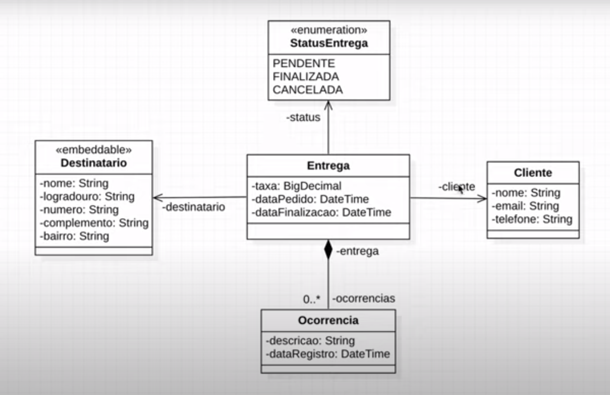

<h1 align="center"> FGA Logistics </h1>

🚀 API em construção desenvolvida durante aulas de Spring Boot, Data, Security 

 Modelo semana de projetos Algaworks 

<h3> Referências </h3>

* https://spring.io/
* https://www.baeldung.com/spring-pathvariable
* https://jakarta.ee/specifications/
* https://martinfowler.com/eaaCatalog/dataTransferObject.html
* https://martinfowler.com/bliki/ValueObject.html
* https://github.com/DozerMapper/dozer
* https://github.com/Naereen/badges
* https://github.com/luong-komorebi/Markdown-Tutorial/blob/master/README_pt-BR.md
* https://blog.rocketseat.com.br/como-fazer-um-bom-readme/
